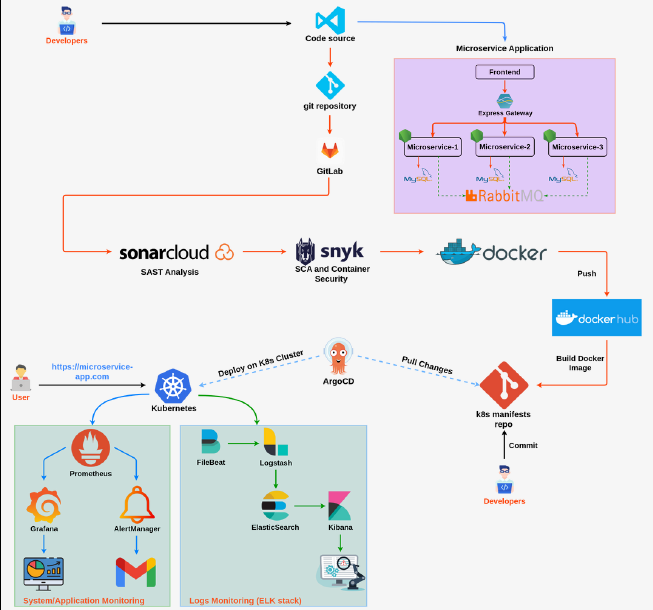

# End-to-End DevOps Project for Microservices 

## Overview

This project demonstrates a comprehensive DevOps pipeline for deploying and managing a microservices-based application. It covers containerization, CI/CD implementation, Kubernetes deployment, and advanced monitoring and observability.

## Technologies

- **Docker**: Containerization of microservices
- **Kubernetes**: Orchestration and management of containerized applications
- **GitLab CI/CD**: Automated testing, building, and deployment
- **Argo CD**: GitOps-based continuous deployment
- **Prometheus**: System and application monitoring
- **Grafana**: Visualization and monitoring dashboards
- **ELK Stack**: Elasticsearch, Logstash, Kibana for log management
- **Istio**: Service mesh for traffic management, secure communication, and observability
- **Helm**: Package management for Kubernetes applications

## Features

- **Containerization**: Microservices are containerized using Docker, ensuring isolated and consistent environments.
- **CI/CD Pipelines**: Automated testing, building, and deployment processes are implemented using GitLab CI/CD.
- **Kubernetes Deployment**: Microservices are deployed in a Kubernetes cluster, with management of configurations, scaling, and persistence. Argo CD is used for GitOps-based continuous deployment.
- **Monitoring and Observability**: Integrated monitoring and observability with Prometheus, Grafana, and the ELK Stack for real-time performance tracking, alerting, and log management.
- **Service Mesh**: Istio is utilized for advanced traffic management, secure communication (mTLS), and improved observability through tracing and logging.

## Architecture Diagram

The following diagram illustrates the architecture of the DevOps pipeline and microservices application:

## Experience Gained

This project provided hands-on experience with a wide range of cloud-native tools and DevOps methodologies, significantly enhancing the efficiency of application deployment and monitoring.

## Project Report

For a detailed step-by-step guide on implementing this DevOps pipeline for a microservices-based application, including containerization, CI/CD pipelines, Kubernetes deployment, and monitoring with Prometheus and Grafana, refer to the full project report:

[Click here to view the project report](https://drive.google.com/file/d/1cMENc9MFp_GTsBFap2PTS819IbVMQJV6/view?usp=drive_link)
